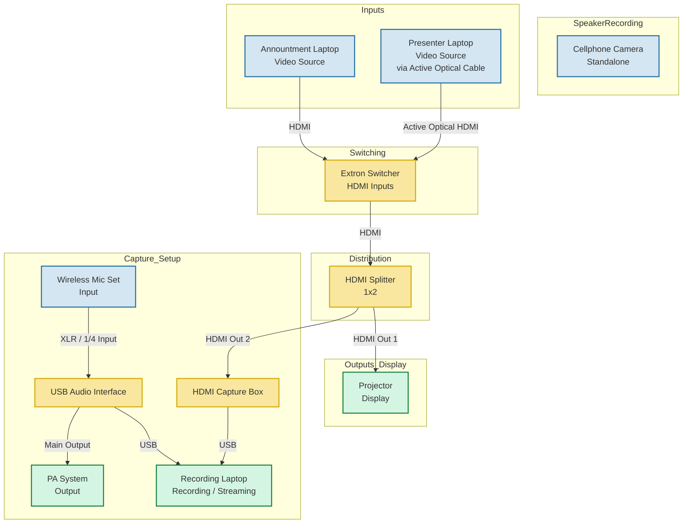

# av-tech
Describe/document the AV setup.

```mermaid

graph TD
    subgraph SpeakerRecording
        PHONE[Cellphone Camera<br>Standalone]
    end

    subgraph Inputs
        L2[Annountment Laptop<br>Video Source]
        L1[Presenter Laptop<br>Video Source<br>via Active Optical Cable]
    end

    subgraph Switching
        EX[Extron Switcher<br>HDMI Inputs]
    end

    subgraph Distribution
        SPLIT[HDMI Splitter<br>1x2]
    end

    subgraph Outputs_Display
        PROJ[Projector<br>Display]
    end

    subgraph Capture_Setup
        CAP[HDMI Capture Box]
        L3[Recording Laptop<br>Recording / Streaming]
        AUDIO_IF[USB Audio Interface]
        WIRELESS[Wireless Mic Set<br>Input]
        PA[PA System<br>Output]
    end

    %% Connections
    L2 -->|HDMI| EX
    L1 -->|Active Optical HDMI| EX

    EX -->|HDMI| SPLIT

    SPLIT -->|HDMI Out 1| PROJ
    SPLIT -->|HDMI Out 2| CAP

    CAP -->|USB| L3

    WIRELESS -->|XLR / 1/4 Input| AUDIO_IF
    AUDIO_IF -->|USB| L3
    AUDIO_IF -->|Main Output| PA

    %% Styling
    classDef source fill:#d4e6f1,stroke:#2874a6,stroke-width:2px;
    classDef processing fill:#f9e79f,stroke:#d4ac0d,stroke-width:2px;
    classDef output fill:#d5f5e3,stroke:#1e8449,stroke-width:2px;

    class L1,L2,PHONE,WIRELESS source;
    class EX,SPLIT,CAP,AUDIO_IF processing;
    class PROJ,PA,L3 output;

```
